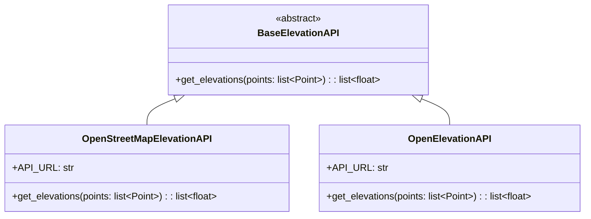

### Class Diagram for `elevation_api.py`: `BaseElevationAPI`, `OpenStreetMapElevationAPI` and `OpenElevationAPI` classes

```mermaid
classDiagram
    class BaseElevationAPI {
        <<abstract>>
        +get_elevations(points: list~Point~): list~float~
    }

    class OpenStreetMapElevationAPI {
        +API_URL: str
        +get_elevations(points: list~Point~): list~float~
    }

    class OpenElevationAPI {
        +API_URL: str
        +get_elevations(points: list~Point~): list~float~
    }

    BaseElevationAPI <|-- OpenStreetMapElevationAPI
    BaseElevationAPI <|-- OpenElevationAPI
```
