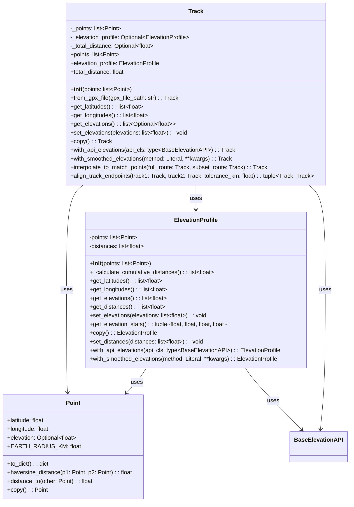

### Class Diagram for `models.py`: `Point`, `ElevationProfile`, and `Track` classes

```mermaid
classDiagram
    class Point {
        +latitude: float
        +longitude: float
        +elevation: Optional~float~
        +EARTH_RADIUS_KM: float
        +to_dict(): dict
        +haversine_distance(p1: Point, p2: Point): float
        +distance_to(other: Point): float
        +copy(): Point
    }

    class ElevationProfile {
        -points: list~Point~
        -distances: list~float~
        +__init__(points: list~Point~)
        +_calculate_cumulative_distances(): list~float~
        +get_latitudes(): list~float~
        +get_longitudes(): list~float~
        +get_elevations(): list~float~
        +get_distances(): list~float~
        +set_elevations(elevations: list~float~): void
        +get_elevation_stats(): tuple~float, float, float, float~
        +copy(): ElevationProfile
        +set_distances(distances: list~float~): void
        +with_api_elevations(api_cls: type~BaseElevationAPI~): ElevationProfile
        +with_smoothed_elevations(method: Literal, **kwargs): ElevationProfile
    }

    class Track {
        -_points: list~Point~
        -_elevation_profile: Optional~ElevationProfile~
        -_total_distance: Optional~float~
        +__init__(points: list~Point~)
        +points: list~Point~
        +elevation_profile: ElevationProfile
        +total_distance: float
        +from_gpx_file(gpx_file_path: str): Track
        +get_latitudes(): list~float~
        +get_longitudes(): list~float~
        +get_elevations(): list~Optional~float~~
        +set_elevations(elevations: list~float~): void
        +copy(): Track
        +with_api_elevations(api_cls: type~BaseElevationAPI~): Track
        +with_smoothed_elevations(method: Literal, **kwargs): Track
        +interpolate_to_match_points(full_route: Track, subset_route: Track): Track
        +align_track_endpoints(track1: Track, track2: Track, tolerance_km: float): tuple~Track, Track~
    }

    ElevationProfile --> Point : uses
    ElevationProfile --> BaseElevationAPI : uses
    Track --> Point : uses
    Track --> ElevationProfile : uses
    Track --> BaseElevationAPI : uses
```
