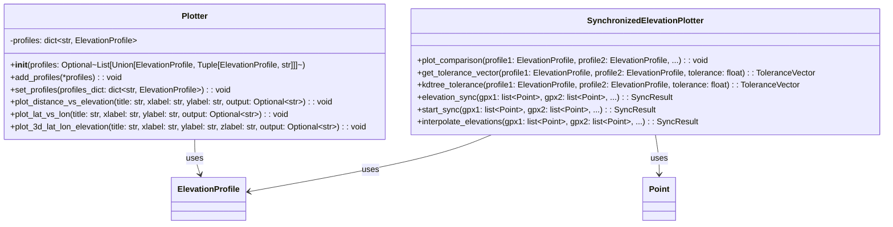

### Class Diagram for `plotter.py`: `Plotter` and `SynchronizedElevationPlotter` classes

#### Type Aliases

- `ToleranceVector`: Boolean NumPy array (`np.ndarray[bool]`)
- `SyncResult`: Tuple of (ElevationProfile, ElevationProfile, ToleranceVector)
